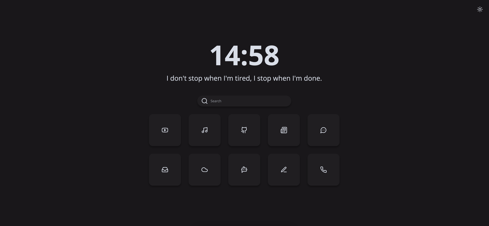

<br />

## 👇 Index

- [👇 Index](#-index)
- [✨ Features](#-features)
- [🚀 Usage](#-usage)
  - [🏡 As Home Page](#-as-home-page)
  - [➕ As New Tab](#-as-new-tab)
  - [🐳 In a Docker Container](#-in-a-docker-container)
    - [Docker run](#docker-run)
    - [docker-compose](#docker-compose)
- [🎨 Customization](#-customization)
  - [👋 General: Image Background and Quotes](#-general-name-image-background-and-quotes)
  - [🏷️ Buttons \& Links](#️-buttons--links)
  - [💛 Colors](#-colors)
  - [🌑 Auto change theme](#-auto-change-theme)

## ✨ Features

- **Easy configuration** file.
- **Dark/Light** mode, you can toggle it and will be saved in local storage.
- **Clock and Date** format can be set to 24 hour (default) or 12 hour.
- **Quotes** are easy to modify.
- **Variables** for custom colors and font sizes in the `app.css` code.
- All **icons** are from [Lucide icons](https://lucide.dev).
- **Modular** javascript files for an easy read.

## 🚀 Usage

### 🏡 As Home Page

1. Fork this repo
2. Enable the Github Pages service `Settings → GitHub Pages → Source [master branch] → Save`
3. Set it as Home Page:
   - Click the menu button. and select Options. Preferences.
   - Click the Home panel.
   - Click the menu next to Homepage and new windows and choose to show custom URLs and add your `Github Pages link`

### ➕ As New Tab

You can use different Add-ons/Extensions for it

- If you use Firefox: [Custom New Tab Page](https://addons.mozilla.org/en-US/firefox/addon/custom-new-tab-page/?src=search) and make sure you enable "Force links to open in the top frame (experimental)" in the extension's preferences page.
- If you use Chromium (Brave, Vivaldi, Chrome): [Custom New Tab URL](https://chrome.google.com/webstore/detail/custom-new-tab-url/mmjbdbjnoablegbkcklggeknkfcjkjia)

### 🐳 In a Docker Container

You can run Bento in a Docker Container, either with `docker run`, or with the included `docker-compose` file.

#### Docker run

1.  Clone this repo to pull the `config.js` file: `git clone https://github.com/migueravila/Bento/`
2.  Run the following `docker` command, providing the path to the `config.js` file, changing port mappings if needed.
3.  `# docker run -it -d -p 80:80 -v <config.js location>:/usr/share/nginx/html/config.js lewisdoesstuff/bento`

#### docker-compose

1. Clone this repo with `git clone https://github.com/migueravila/Bento/`
2. Edit port mappings, and provide a path to the `config.js` file in `docker-compose.yml`
3. `cd` into the cloned repo, then run `# docker-compose -d up` to start.

## 🎨 Customization

All customization can be managed in the `config.js` file:

### 👋 General: Image Background and Quotes

To change the quotes and if you want to have an image background or open your links in new tabs, edit the first configs in the `config.js`.

```js
  // General
  imageBackground: false,
  openInNewTab: true,

  // Quotes
  quotes: [
		"Becoming more like Batman.",
		"I don't stop when I'm tired, I stop when I'm done.",
		"You weren't winning, I was just losing.",
	],

```

> You can change the background by replacing the `background.jpg` file in `assets` folder.


### 🏷️ Buttons & Links

To edit the buttons you just need to change the follow list in the `config.js` file by choosing a link, an icon from [Lucide icons](https://lucide.dev) and a name.

```js
  buttonsContainer: [
		{
			id: '1',
			name: 'Youtube',
			icon: 'youtube',
			link: 'https://youtube.com',
		},
		{
			id: '2',
			name: 'Youtube Music',
			icon: 'music',
			link: 'https://music.youtube.com',
		},
		{
			id: '3',
			name: 'Gmail',
			icon: 'inbox',
			link: 'https://mail.google.com',
		},
		{
			id: '4',
			name: 'Drive',
			icon: 'cloud',
			link: 'https://drive.google.com',
		},
		{
			id: '5',
			name: 'Github',
			icon: 'github',
			link: 'https://github.com/',
		},
		{
			id: '6',
			name: 'ChatGPT',
			icon: 'bot-message-square',
			link: 'https://chat.openai.com',
		},
		{
			id: '7',
			name: 'Tech Crunch',
			icon: 'newspaper',
			link: 'https://techcrunch.com',
		},
		{
			id: '8',
			name: 'Medium',
			icon: 'pen-line',
			link: 'https://www.medium.com',
		},
		{
			id: '9',
			name: 'Discord',
			icon: 'message-circle-more',
			link: 'https://www.discord.com',
		},
		{
			id: '10',
			name: 'Whatsapp',
			icon: 'phone',
			link: 'https://web.whatsapp.com',
		},
	],
```

### 💛 Colors

In the `app.css` file you can change the variables for both themes (Dark and Light):

```css
/* Light theme  */

:root {
	--accent: #61b0f1; /* Hover color */
	--bg: #f5f5f5; /* Background color */
	--sbg: #e4e6e6; /* Cards color */
	--fg: #3a3a3a; /* Foreground color */
	--sfg: #3a3a3a; /* Sceondary Foreground color */
}

/* Dark theme  */

.darktheme {
	--accent: #61b0f1; /* Hover color */
	--bg: #19171a; /* Background color */
	--sbg: #201e21; /* Cards color */
	--fg: #d8dee9; /* Foreground color */
	--sfg: #3a3a3a; /* Secondary Foreground color */
}
```

### 🌑 Auto change theme

The theme can be automatically changed by the OS' current theme or personalized hours
that you can change in the `config.js` file:

```js
  // Autochange
  autoChangeTheme: true,

  // Autochange by OS
  changeThemeByOS: false,

  // Autochange by hour options (24hrs format, string must be in: hh:mm)
  changeThemeByHour: true, // If it's true, it will use the values below:
  hourDarkThemeActive: '18:30', // Turn on the dark theme after this hour
  hourDarkThemeInactive: '07:00', // Turn off the dark theme after this hour and before the above hour
```


